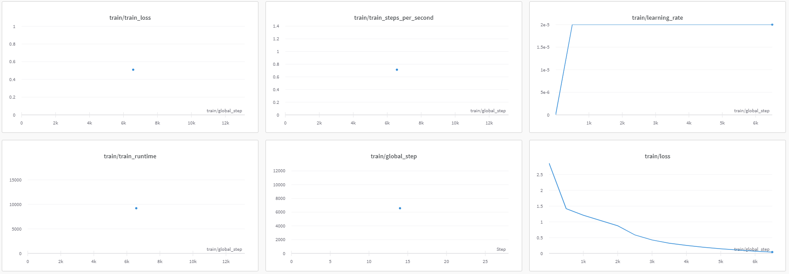
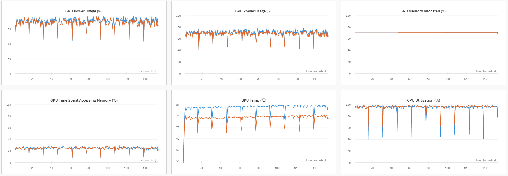

## DeepSpeed 

- [DeepSpeed](https://github.com/microsoft/DeepSpeed)
- [DeepSpeed.ai](https://www.deepspeed.ai/)

### ZeRO stage 3 Offload

- Env
  - ubuntu 22.04
  - python 3.10.6
  - cuda 11.8
  - torch 2.0.1
  - transformers 4.28.1
  - deepspeed 0.9.2


- Finetuning format of Dataset
```
{"text":"### 명령어: 점심 메뉴 추천해주세요\n\n### 결과: 아무거나 드세요^^;"}
{"text":"### 명령어: 주어진 품목에 대한 분류 광고를 작성합니다.\n\n### 입력: 중고 노트북\n\n### 결과: 중고 노트북에 대한 분류 광고를 작성하는 방법은 노트북의 용도, 판매 이유 및 제품의 상태에 따라 다릅니다. 중고 노트북을 공부나 일용으로 사용할 분을 위한 광고를 작성하거나, 가격 저렴한 중고 노트북을 찾고 있는 이들에게 광고할 수 있습니다."}
```

- [run_clm.py](https://github.com/Beomi/KoAlpaca/blob/main/train_v1.1b/run_clm.py), shell script로 구동
``` python
# Tesla V100s 2ea
torchrun --nproc_per_node=2 --master_port=34321 run_clm.py \
    --model_name_or_path='EleutherAI/polyglot-ko-1.3b' \
    --train_file='{YOUR_DATA}' \
    --num_train_epochs=3 \
    --block_size=1024 \
    --per_device_train_batch_size=1 \
    --gradient_accumulation_steps=1 \
    --torch_dtype=float16 \
    --fp16 \
    --output_dir='polyglot-1.3b_mymodel' \
    --deepspeed=ds_zero3-nooffload.json \
    --do_train \
    --save_strategy='epoch' \
    --logging_strategy='steps' \
    --logging_first_step \
    --save_total_limit=10 \
    --run_name='polyglot-1.3b_mymodel_fp16'


./train.sh
```

### Result

- [Result](https://wandb.ai/dongryeol/huggingface/runs/uiau5p0y?workspace=user-dongryeol)

- 
- 
